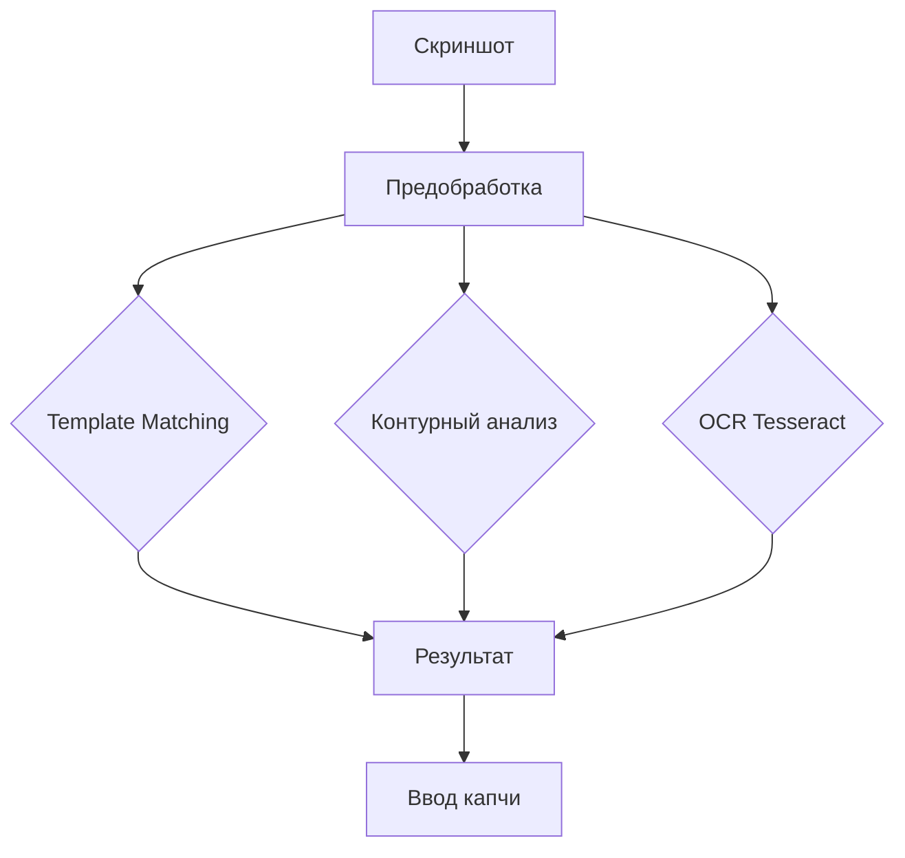

# 🎯 Auto Captcha Solver

<div align="center">


[](https://github.com/yourusername/auto-captcha-solver)
[](https://github.com/yourusername/auto-captcha-solver)

**Автоматический решатель 5-значных цифровых капч с возможностью выбора области экрана**


</div>

---

## 📋 Описание

Мощный инструмент для автоматического распознавания и ввода 5-значных цифровых капч в играх и приложениях. Использует комбинацию методов компьютерного зрения для максимальной точности распознавания.

## ✨ Основные возможности

<table>
<tr>
<td>

### 🎯 Точное распознавание
- Template Matching
- Контурный анализ
- OCR через Tesseract
- Multi-scale поиск

</td>
<td>

### ⚡ Быстродействие
- Распознавание < 0.5 сек
- Мгновенный ввод
- Минимальная нагрузка
- MSS для захвата

</td>
<td>

### 🎮 Удобство
- Горячие клавиши
- Выбор области
- Авто-режим
- Сохранение настроек

</td>
</tr>
</table>

## 📊 Статистика производительности

<div align="center">

| Метрика | Значение |
|---------|----------|
|  | Время распознавания |
|  | С правильными эталонами |
|  | Нагрузка на процессор |
|  | Использование памяти |

</div>

## 🚀 Установка

### Требования


### Зависимости

```bash
pip install pyautogui pytesseract pillow opencv-python numpy keyboard mss pywin32
```

### Tesseract OCR (опционально)

[](https://github.com/tesseract-ocr/tesseract)

Для улучшенного распознавания установите Tesseract OCR

## 💻 Использование

### Быстрый старт

```bash
git clone https://github.com/yourusername/auto-captcha-solver.git
cd auto-captcha-solver
python captcha_solver.py
```

### Первоначальная настройка

1. **Запустите скрипт**
   ```bash
   python captcha_solver.py
   ```

2. **Выберите область капчи** - нажмите `F4` и выделите зону

3. **Настройте эталоны** - добавьте реальные цифры в папку `numbers/`

## ⌨️ Горячие клавиши

<div align="center">

| Клавиша | Действие | Описание |
|:-------:|----------|----------|
|  | Решить капчу | Однократное распознавание и ввод |
|  | Автоматический режим | Непрерывное сканирование |
|  | Остановить | Прекратить авто-режим |
|  | Выбрать область | Указать зону с капчей |
|  | Сбросить область | Использовать весь экран |
|  | Выход | Закрыть программу |

</div>

## 📁 Структура проекта

```
📦 auto-captcha-solver/
┣ 📜 captcha_solver.py      # Основной скрипт
┣ 📂 numbers/               # Эталонные изображения цифр
┃ ┣ 📷 0.png
┃ ┣ 📷 1.png
┃ ┗ 📷 ...
┣ 📂 screenshots/           # Сохраненные скриншоты
┗ 📄 config.json           # Конфигурация
```

## 🔧 Конфигурация

Файл `config.json` создается автоматически:

```json
{
  "search_region": [100, 200, 300, 50],
  "confidence_threshold": 0.7,
  "typing_delay": 0.02,
  "scan_interval": 0.1
}
```

## 📈 Методы распознавания

<div align="center">



</div>

## 🛠️ Решение проблем

<details>
<summary><b>❌ Не распознает цифры</b></summary>

- Обновите эталоны в папке `numbers/`
- Используйте реальные цифры из вашего приложения
- Проверьте качество изображений

</details>

<details>
<summary><b>🐌 Медленная работа</b></summary>

- Выберите область капчи (F4)
- Уменьшите область сканирования
- Закройте лишние приложения

</details>

<details>
<summary><b>⚠️ Ошибка Tesseract</b></summary>

- Установите Tesseract OCR
- Или работайте без него (Template Matching)
- Проверьте путь к tesseract.exe

</details>

## 🤝 Вклад в проект

[](http://makeapullrequest.com)

Приветствуются любые улучшения! Создавайте Issue и Pull Requests.

## 📝 Лицензия

[](https://opensource.org/licenses/MIT)

MIT License - свободное использование и модификация

## ⚠️ Дисклеймер

> **Важно:** Используйте только в образовательных целях и в соответствии с правилами целевого приложения.

## 👨‍💻 Автор

<div align="center">

Разработано с ❤️ для автоматизации рутинных задач

[](https://github.com/yourusername)
[](mailto:your.email@example.com)

</div>

---

<div align="center">

### ⭐ Если проект был полезен, поставьте звезду!

[](https://star-history.com/#yourusername/auto-captcha-solver&Date)

</div>
